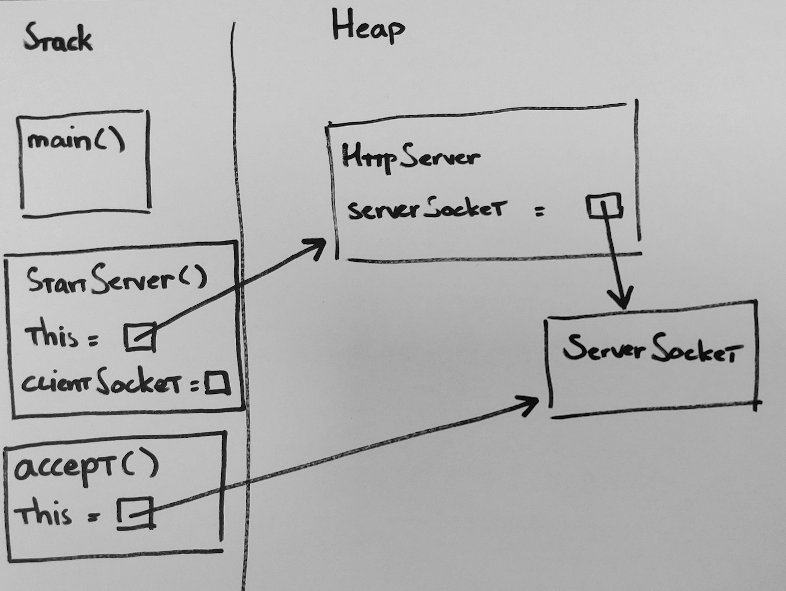

# Introductie

Deze oefening is deel van de BEWD Course aan de Hogeschool Arnhem/Nijmegen.
Onderwerp is het bekend raken met het Http-protocol in een simpele Java-server.

Web servers, gebruikt op het internet zijn feitelijk server-software die voldoen
aan het Http-protocol.
Het Http-protocol, zoals ook alle andere internet protocols, is gespecificeerd
in een *Request for Comments* (RFC). De RFC voor Http kan hier gevonden
worden: [https://tools.ietf.org/html/rfc7230]().

# Oefeningen

Bekijk de startcode in de master-branch. De server is op te starten via de
main-methode van de `HttpServer` klasse.
Voer deze methode uit. De Server is nu opgestart. Navigeer via je browser
naar [http://localhost:8383/index.html]() om te zien wat de server teruggeeft.

## 1) Helder krijgen hoe de HTTP-server werkt

Om helder te krijgen hoe de HTTP-server werkt, maken we gebruik van het
geheugenmodel. Hieronder het geheugenmodel op het moment dat `accept()`
wordt aangeroepen op de instantie van `ServerSocket`.

* Teken nu een nieuw geheugenmodel voor het moment dat de
  `ConnectionHandler` is aangemaakt en ook daar `accept()` op wordt
  aangeroepen, maar hij nog niet in deze methode is gegaan.
* Wanneer is het Http-request nu volledig afgehandeld? Op welke regel code
  zit je dan?

## 2) Gebruik Postman om een Request te sturen

Gebruik nu Postman om een GET-request te sturen naar je eigen Http-server.

* Verstuur een GET naar URL de [http://localhost:8383/index.html]() en bekijk
  het resultaat.
* Selecteer nu een andere Http-methode in Postman en bekijk her resultaat.
  Is dit wat je verwacht? En kun je in de Java code de plek aanwijzen waar
  dit is uitgeprogrammeerd?

  

### 2.7) Correcte versie van het Http-protocol

Zoek uit welke versie van het Http-protocol wordt gebruikt en zorg ervoor dat
dit ook correct staat in de
Http-response-header.

# Extra uitdaging

Het Http-protocol kent meer methodes dan enkel de *GET*. Lees de RFC voor meer
informatie en implementeer ook de
methode *HEAD*.

 

